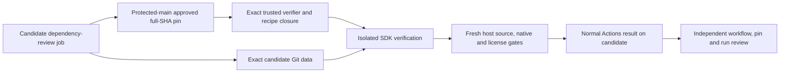

# Canonical SDK category verification

This candidate replaces candidate-controlled SDK evidence with a fixed recipe,
fresh isolated execution, and category-aware dependency accounting. Its base is
reviewed PR #970, `8d480b1af59d7da0b7184d5b9ee9be4525f90e45`.
The exact candidate revision is recorded in the draft PR and workflow run.
Main remains `1853ed33fe5aa0b159597b914a5e77c84a69d193` at validation.

The canonical SDK remains an expected component. Its native indexing is
`NOT_CLAIMED`; a successful source check cannot relabel GitHub's raw native
coverage. Every other expected Pub, npm, linked npm, and Python component retains
its existing native coverage obligation. SDK source or OpenAPI changes also
create an obligation when `lythaus_api_client` remains version `1.0.0`.

## Trust boundary

Protected main supplies the bootstrap and approval record. That record must pin
a different, independently reviewed verifier commit, its complete Git tree, and
the dependency-review workflow blob. The bootstrap checks public read-only GitHub
repository metadata, run, workflow, and attempt-specific job responses against
the verified numeric repository ID and owner ID, repository name, workflow
path, exact workflow revision, run ID, attempt, and actual job ID.
Names alone do not establish authority. The existing `dependency-review` job
runs the independently reviewed verifier directly from its approved full Git SHA
for PRs, main pushes and candidate-ref dispatches. Protected main selects the
pin; candidate inputs cannot select a verifier ref. The entire hosted recipe,
imports and npm closure are materialized from that pinned tree, and the final
host gate executes the pinned bootstrap, not a candidate checkout helper.

For a PR, the candidate head is bound to the API run/job head SHA while the
tested workflow is bound to the runner's merge revision and its exact approved
workflow blob. The merge parents must be the exact base and candidate commits.
The runner event, PR number, repository IDs, base/head refs and SHA snapshots
must agree with the actual run metadata. Main pushes bind the exact before/after
event; dispatch must select the exact candidate revision supplied as head input.
A main dispatch for a different candidate SHA is rejected.

Actions publishes the normal candidate-bound job result. No custom Checks API
write, status override, required-workflow infrastructure or additional permission
is needed. [GitHub documents](https://docs.github.com/en/pull-requests/reference/status-checks)
that Actions generates checks when workflows run. The workflow keeps the
existing job name and `contents: read` permissions and performs fresh native,
archive-license and source gates in that same job.

This uses the existing independent code-review trust boundary: the parent or
reviewer checks the exact candidate workflow, the approved full verifier pin,
and the actual run/attempt/job identity before accepting its result. Approval of
the verifier alone does not approve arbitrary candidate workflow changes or a
different job with the same name. A candidate can edit its YAML; an altered or
bypassed workflow must not be accepted as reviewed evidence. No self-approval,
new protection rule or invented owner decision is introduced. The previously
denied branch-protection endpoint is not queried again.



The host materializes the verifier's recipe, imports, preparation scripts,
fixtures, setup code, npm lock and workspace/file-package manifests from the
pinned Git objects. `npm ci --ignore-scripts` installs that reviewed closure.
The pinned workflow is included and trusted regular-file executable modes are
preserved for the retained local tool entrypoint. Symlinks and submodules remain
rejected.
User and global npm configs are distinct empty private files, with a fresh cache,
fixed public registry, lifecycle hooks disabled and only PATH/CI inherited.
Candidate package scripts, TypeScript wire generators, and candidate checkout
helpers are never host verdict inputs. The candidate contributes exact Git
objects for the application manifests/lock, Flutter version, OpenAPI sources and
bundle, and canonical SDK. Checkout edits do not change these objects.

The host verifies complete hosted archive hashes from both locks and rejects
unsafe archive members. It launches a disposable non-root Docker container with
no network, a read-only root, dropped capabilities, no new privileges, isolated
processes, and bounded CPU/memory/PIDs. Candidate code sees fixed preparation
scripts and read-only fixtures, tool/package mounts, and a private writable
work directory. It cannot see the host verdict modules, source repository Git
directory, Docker socket, credentials, or GitHub commandfiles. Pub's writable
cache metadata is disposable; hosted package contents and integrity files remain
read-only. Candidate stdout is captured as bounded data and never forwarded to
the workflow command channel.

Each container creation journals its unique name before the Docker request,
plus a private cidfile and ownership label. If interruption occurs after daemon
creation while the cidfile is missing, empty or contains a partial hexadecimal
ID, cleanup inspects only that journaled run-specific name and records its full
ID after verifying the name and ownership label. A partial cidfile must match
that full ID's prefix. Once a complete cidfile has been observed, changing or
truncating it is rejected. Symlinks, hardlinks, special files and malformed IDs
remain rejected. An arbitrary name or another owner's label cannot supply a cleanup ID.
Removal always uses a verified full ID and checks that it is absent. SIGINT and SIGTERM interrupt
the asynchronous Docker client, escalate its owned process group after one
second, and allow at most 30 seconds for ID cleanup. Exit codes 130 and 143 are
preserved even if cleanup itself reports a failure. Journals retain IDs and
cleanup outcomes; no name-based kill, daemon-wide prune or unrelated-container
removal is used. SIGKILL, runner loss or Docker-daemon loss cannot be caught and
can require coordinator cleanup from the retained journal.

First, the trusted recipe rebundles OpenAPI and regenerates the SDK using pinned
Redocly/npm and OpenAPI Generator 7.7.0. The host compares the bundle and all
994 tracked generated files, excluding only the existing generated `FILES`
inventory exception. Preparation starts only after those comparisons match.
Frozen generator and application locks prepare serializers and the real
`build/api_client` path. Complete dependency graph nodes, versions, sources and
edges must agree with the locks. The SDK's 24-package application runtime closure
is recorded separately from the generator's 67 hosted packages (68 graph nodes).

Fixed fixtures pass static analysis with the retained strict project rules in
isolation. The analyzer's home is disposable and contains no host credentials;
analytics is disabled. Seven fixed synthetic suites run against the prepared SDK with the frozen
application graph and a fixed 57-case catalogue. Both deliberate
SDK mutants must produce named assertion failures; compilation/process failures
do not count. The host checks source preservation after each execution and
rejects symlinks, hardlinks, special files and oversized outputs. It aggregates
the fresh in-memory source result with native severity/coverage and the existing
archive-license policy. The CLI accepts no transported receipt as proof.

## Serialized bootstrap and owner gates

This PR deliberately leaves `canonical-sdk-trust.json` in
`pending-independent-review`. Its author cannot select their own trusted SHA.

1. Independently review and publish the verifier foundation as commit A through
   the coordinator's normal serialized process. This task does not merge it.
2. In a separate reviewed change B on protected main, pin A, its Git tree and
   unchanged workflow blob, with the independent review reference. A does not
   embed its own future SHA. B supplies the anchor without changing A's recipe.
3. Resolve SDK ownership/license evidence in protected-main
   `infrastructure/canonical-dart-package-approval.json`. The record must bind
   package/version, the exact library tree and manifest blob, ownership,
   explicit license expression, evidence path/blob and owner approval reference.
4. Supply reviewed exact archive/license hashes and expressions for every SDK
   runtime package in protected-main
   `infrastructure/canonical-dart-runtime-licenses.json`. Missing evidence,
   including the previously unresolved `one_of` and `one_of_serializer`, remains
   `HOSTED_RUNTIME_LICENSE_EVIDENCE_REQUIRED`; archive presence alone is not a
   license approval. The existing denied-license policy still applies.
5. Independently review the candidate's exact workflow and approved pin. Run
   the existing candidate-bound `dependency-review` job (PR, main push, or
   dispatch selecting that exact candidate revision with distinct base/head
   inputs). No verifier ref is supplied by the candidate.
6. Require fresh source verification, native policy review and archive-license
   gates to pass in that job. Before acceptance, the parent/reviewer verifies
   the exact workflow blob/revision, approved verifier SHA/tree and actual
   candidate-bound run/attempt/job result. No main-only result substitutes for
   candidate verification.

No owner/classification/license approval record is created here. Existing root,
OpenAPI and generated metadata are preserved. The root license's vendor history
and OpenAPI's MIT metadata do not automatically assign the generated SDK's
license. No signing infrastructure, dependency submission, public attestation,
new credentials, additional token permission, provider/DDL/release mutation, or
merge is part of this change.

## Requirements to code to tests

| Requirement | Code | Evidence |
| --- | --- | --- |
| Independent pin; no self-approval | `canonical-sdk-bootstrap.mjs`, pending `canonical-sdk-trust.json` | Synthetic repository/workflow/job/revision attacks; real Git bootstrap projection test |
| Candidate-bound read-only job; reviewed verifier pin | `dependency-review.yml`, `validateRunContext`, `anchoredContext` | PR merge/candidate distinction; exact push/dispatch inputs; real Git pin/merge projection; altered workflows and candidate-selected verifier refs rejected |
| Exact candidate data; same-version obligation | `canonical-sdk-contract.mjs`, `dependency-review-native.mjs` | Dirty checkout ignored; source-only SDK commit remains expected; nonregular Git input rejected |
| Fixed complete recipe and tool closure | `sdk-verifier/`, `setup-canonical-sdk-tools.mjs` | Frozen lock/hash checks; complete app and generator graph tests; matched full regeneration |
| Candidate execution isolated | `canonical-sdk-isolation.mjs` | Real container denies fixture/input writes, credentials, host processes, Docker socket and gate files |
| Cancellation removes owned IDs only | `canonical-sdk-containers.mjs`, async isolation calls, CLI exit handling | Real SIGINT/SIGTERM running and missing/empty/partial cidfile creation-race tests, sentinel preservation, timeout/output-limit cleanup, name/label/cid/prefix/deadline rejection |
| Complete hosted integrity and safe extraction | `sdk-verifier/cache-hosted-packages.py` | 207 real locked archives verified; six synthetic archive tests reject tamper, traversal, links and duplicate files |
| Trusted behavior and assertion mutants | Fixed Dart fixtures, `behavior-cases.json`, fixed monthly JSON | 57 successful cases/seven suites; bearer omission and own-route mutants produce genuine named assertion failures |
| SDK remains accounted; other native policy preserved | Native probe, receipt aggregator, license resolver | Missing hosted/linked components, warnings, severity/license failure and stale/ineligible source result all block |
| License/classification remains an owner gate | Protected-main approval reader, `approvedLicenseClassification` | Unapproved/stale source, missing archive/license hashes and denied expressions block; no production approval supplied |

## Validation and provenance

Focused validation covers 39 verification/policy tests, twenty isolation/cleanup
tests (including twelve real Docker controls), six
existing Dart archive-license tests, and six new archive extraction tests. The
isolated development runner passes all 57 Dart behavior cases and both assertion
mutants. It reports `coverageEligible: false`,
`TRUSTED_VERIFIER_BOOTSTRAP_REQUIRED`, and `nativeIndexing: NOT_CLAIMED`.
Focused Node coverage is reported separately from isolated execution; unapproved
production activation and external setup are not represented as executed gates.

The empty/partial cidfile controls create actual Docker containers with
`--cidfile`, verify the daemon's full ID, then inject an empty regular file or a
32-character ID prefix before the owner consumes it. Both SIGINT and SIGTERM
must preserve 130/143, remove the verified owned ID within the bounded cleanup,
and preserve a separate owner's real sentinel. This is controlled synthetic
write-interruption fault injection, not a claim that Docker naturally produced
a partial file during these tests.

The useful preparation evidence from PR #969 is reused with provenance from
`f78891e03be905cb83860ffc1b8d075fb546094a`: its added canonical behavior fixture,
temporary toolchain manifest/lock, and captured synthetic monthly wire vectors.
The previous candidate wire generator is not executed by this verifier. The
other six suites and the frozen admission guard come from reviewed #970.
This does not copy #969's unrelated browser changes or undo #970's type guards.
The latest 13,500 monthly threshold and all disabled-feature distinctions remain.

The captured monthly vector SHA-256 is
`6ff648555286eafcb4498a45630a373b1a2f1031832b87b3fb54fac5349bec22`.
The fixed file adds a terminal newline and has SHA-256
`bf9a02797e9343e7c462c02041f62707567e364152fcb363421c6daacb0a1564`;
the frozen generator lock SHA-256 is
`f0b06e8d6004fce4e9f25d8fe3b5f3175a5277ab4a3939918d7289a95ba6e3a3`.
The compared SDK library tree is
`361ab63c3aa1bc9d2940e87d5ce213953a580a52`. The prepared package has 641
regular files. All fixtures are synthetic and contain no production data.

Local reproduction, using the installed reviewed toolset:

```sh
node --test scripts/tests/canonical-sdk-verification.test.mjs scripts/tests/dependency-review-policy.test.mjs
LYTHAUS_RUN_ISOLATION_TEST=1 node --test scripts/tests/canonical-sdk-isolation.test.mjs
python3 scripts/ci/test_dart_license_review.py
python3 scripts/ci/test_sdk_archive_cache.py
node scripts/ci/canonical-sdk-verifier.mjs --development-only --candidate <exact-commit>
```

The development command cannot activate eligibility. Its local evidence is
unsigned diagnostic data. Candidate jobs remain blocked until the separately
reviewed verifier pin and owner license/classification records are published.
No eligible activation run or additional hosted CI is dispatched by this lane.
Screenshots are unnecessary because this patch changes no rendered UI.

The single requested hosted CI cycle ran on
`06f00ab66ea7cf1e51386b315b395d1eefccdbac`. Dependency review stopped at the
unpublished trusted-verifier gate. Repository CI exposed external-namespace
branding matches and two fixture list-inference warnings; these are corrected
by numeric repository/owner binding and explicit list types, preserving the
checks. Its subsequent browser check lacked npm dependencies because analysis
had failed, and the audit rollup reported those failed gates. The revised head
is revalidated locally; another hosted cycle remains for serialized review.

Independent review identified the dispatch/required-check mismatch and missing
signal cleanup. The final strategy executes the approved verifier in the existing
candidate-bound job, with normal Actions check publication and read-only
permissions. The follow-up also covers interruption after daemon creation with
no cidfile: journaled-name discovery requires the ownership label, then deletion
uses the recovered full ID. Both signals preserve their cancellation codes and
an unrelated owner's sentinel remains present. Exact-head SDK validation and
coordinator CI/review evidence are recorded in PR #971; this lane does not
dispatch another hosted cycle.
